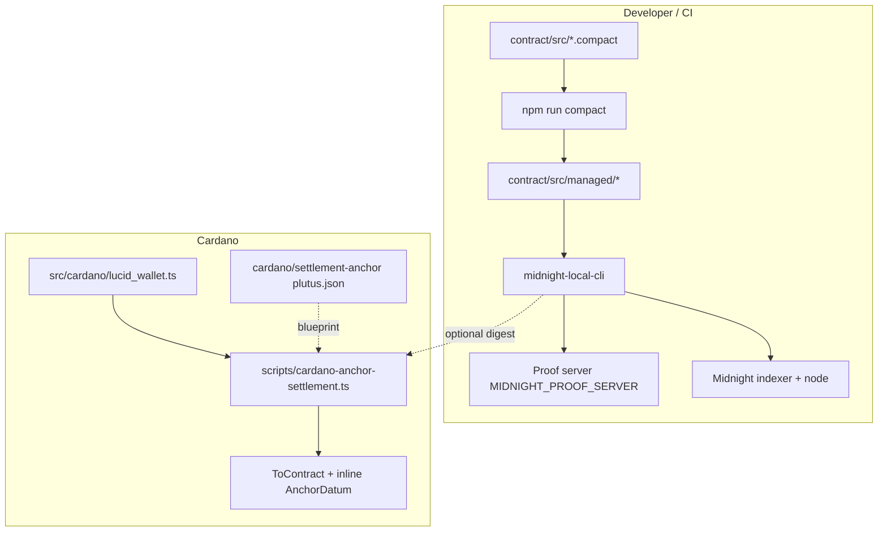
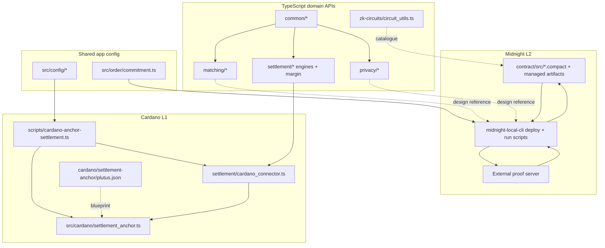
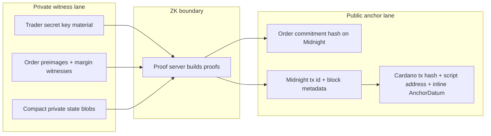
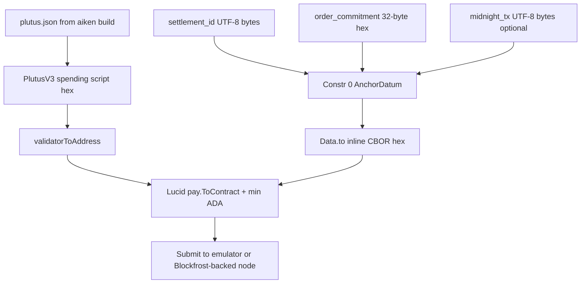
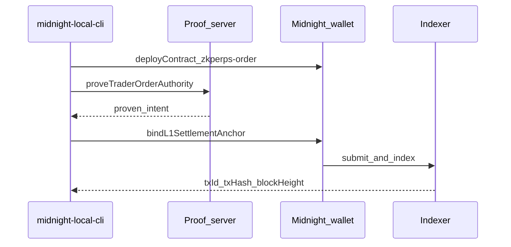
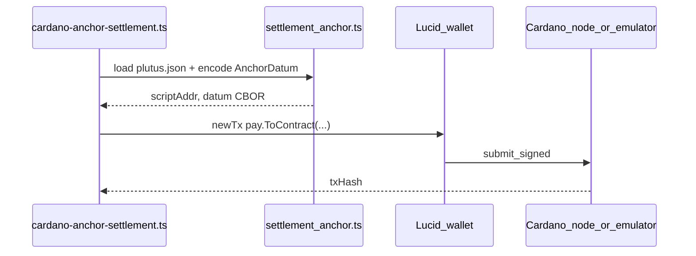
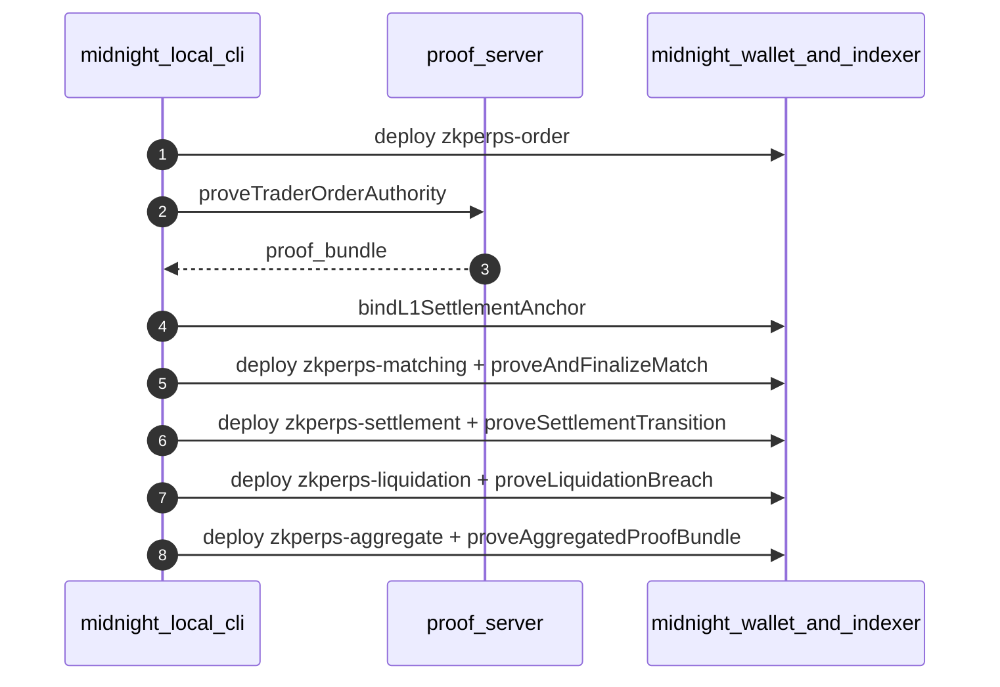

# System Architecture

**Anti-Front-Running ZK Perpetuals on Cardano — Midnight ZK**  
**Version:** 0.2.0 — architecture & prototype milestone  
**Specification:** [Software requirements][spec], v0.1.0, March 2026  
**Source repository:** [github.com/Nucastio/Anti-Front-Running-ZKPerps-on-Cardano-w-MidnightZK][repo]  
**License:** MIT

---

## 1. Executive summary

Public mempools expose pending transactions, enabling reordering, front-running, and MEV. Perpetual markets amplify timing risk because execution order affects PnL.

This project prototypes **private order commitments**, **Midnight Compact ZK circuits** with proof server and ledger verification, **matching / settlement / liquidation / aggregation** contracts on Midnight, and **Cardano-anchored digests** via an **Aiken Plutus script** (`cardano/settlement-anchor/`) with **inline `AnchorDatum`** so sensitive intent is not revealed in clear before execution paths that the specification describes, while L1 references remain auditable.

**Design anchors** — see specification for full text and numbering:

- Commitment-based orders and trader authority — §3.1–3.3, §7.1.
- Proof-backed matching, settlement transitions, liquidation, and aggregation — §3.4–3.6, §7.
- Performance and security targets — §8, §10–11.

**How to read this document.** Sections **2–5** map the repository to responsibilities. **§6** collects **interaction and data-flow diagrams**. **§7** lists automation and demos. **§8–10** cover Midnight configuration, security, and benchmarks. **§11** holds **three sequence diagrams**. **§12** embeds **condensed API excerpts** for five modules; full tables remain in each module’s `API.md`. **§13–14** deepen Cardano and Midnight integration and describe tests. **§15** lists references. For PDF export, use a monospace-friendly theme; diagram rendering affects printed page count — this file is intentionally verbose to satisfy multi-page architecture deliverables.

---

## 2. Repository map — what lives where

Monorepo: **npm workspaces** `contract` + `midnight-local-cli`; shared TypeScript at repo root.

| Area | Path | Role |
|------|------|------|
| **Compact sources** | `contract/src/*.compact` | Five contracts: `zkperps-order`, `zkperps-matching`, `zkperps-settlement`, `zkperps-liquidation`, `zkperps-aggregate`. |
| **Witness wiring** | `contract/src/witnesses-*.ts` | Midnight.js witness builders per package. |
| **Compiled artifacts** | `contract/src/managed/zkperps-*/` | Output of `npm run compact`: per-package ZK layout, typings, managed assets. |
| **Contract package API** | `contract/src/index.ts`, `contract/src/midnight-deploy.ts` | Exports `CompiledContract` bindings, private state ids, zk config paths for all five packages. |
| **Midnight CLI** | `midnight-local-cli/src/` | `deploy-zkperps.ts`, `run-zkperps-all.ts` for order-only path, `run-pipeline-all.ts` for full five-contract path, wallet/DUST, providers, `ZkperpsMidnightConfig`, local `midnight_network.ts`. |
| **App / Cardano shared** | `src/config/` | `midnight_network.ts`, `cardano_env.ts` — used by Lucid scripts and tests; NuAuth-style env. |
| **Order helpers** | `src/order/` | Off-chain commitment construction + **Vitest** unit tests. |
| **Cardano** | `src/cardano/lucid_wallet.ts`, `src/cardano/settlement_anchor.ts` | Lucid Evolution wallet + **Aiken** settlement anchor (blueprint `plutus.json`, inline datum). |
| **Cardano contracts (Aiken)** | `cardano/settlement-anchor/` | `settlement_anchor` validator; `aiken build` → `plutus.json`. |
| **CIP-20 (optional)** | `src/lib/cip20.ts` | Message chunking helper + tests; **not** used for the L1 settlement anchor path. |
| **Domain modules — TS** | `matching/`, `settlement/`, `privacy/`, `common/` | Typed APIs and reference logic; see each `API.md`. Not all paths are wired end-to-end in the CLI slice. |
| **Circuit catalogue** | `zk-circuits/circuit_utils.ts`, `zk-circuits/API.md` | Metadata / IDs for circuits and links to Compact sources. |
| **Automation** | `scripts/` | Benchmarks, **`cardano-anchor-settlement.ts`** (L1 anchor tx), **`bench-cardano-emulator.ts`**, pipeline evidence, CLI/HTML/MP4 demos; see §7. |
| **Documentation** | `docs/` | Architecture — this file — SRS, benchmarks, demo, `srs-pipeline-run.md` capture log, `testnet-evidence.md`. |
| **Root** | `testnet-evidence.md` | Optional duplicate / scratch; README points to `docs/testnet-evidence.md` for explorer links. |

**Workspaces — npm:**

- `@zkperps/midnight-contract` — `contract/`
- `@zkperps/midnight-local-cli` — `midnight-local-cli/`

Root **`package.json`** scripts orchestrate install, contract build, tests, benches, Midnight runs, and demos.

---

## 3. On-chain prototype: Midnight entrypoints

The **implemented** on-chain slice is driven by **`midnight-local-cli`** using `@midnight-ntwrk/midnight-js-contracts` `deployContract` and compiled artifacts under `contract/src/managed/…`.

### 3.1 Order-only path — `run-zkperps-all.ts`

Invoked as **`npm run midnight:run-all`**, workspace script `run-all`.

1. Sync wallet + **DUST** readiness via `ensureDustReady`.
2. Deploy **`zkperps-order`** with constructor args `orderCommitment` and `traderPk`.
3. `proveTraderOrderAuthority` as ZK step.
4. `bindL1SettlementAnchor` with `l1Anchor` — binds a 32-byte digest, intended to align with the Cardano settlement **anchor datum** (`order_commitment` / related fields).

Environment highlights: `BIP39_MNEMONIC`, `ZKPERPS_TRADER_SK_HEX`, `ZKPERPS_ORDER_COMMITMENT_HEX`, `ZKPERPS_L1_ANCHOR_HEX`, `MIDNIGHT_DEPLOY_NETWORK`, `MIDNIGHT_PROOF_SERVER`, optional indexer/node overrides; see `midnight-local-cli/README.md`.

### 3.2 Five-contract pipeline — `run-pipeline-all.ts`

Invoked as **`npm run midnight:run-pipeline`**, workspace script `run-pipeline`.

Sequential deploy + ZK calls:

| Contract | Deploy | Follow-on ZK transactions |
|----------|--------|---------------------------|
| `zkperps-order` | ✓ | `proveTraderOrderAuthority`, `bindL1SettlementAnchor` |
| `zkperps-matching` | ✓ | `proveAndFinalizeMatch` with `matchDigest` |
| `zkperps-settlement` | ✓ | `proveSettlementTransition` with `settlementNextDigest` |
| `zkperps-liquidation` | ✓ | `proveLiquidationBreach` with `threshold` |
| `zkperps-aggregate` | ✓ | `proveAggregatedProofBundle` |

Default **32-byte hex** placeholders for matching/settlement/liquidation/aggregate witnesses are supplied via env vars `ZKPERPS_*`; see CLI README so undeployed runs succeed without manual witness crafting.

### 3.3 Contract build pipeline

From repo root:

1. `npm run compact` — runs **`compact compile`** for each `.compact` into `contract/src/managed/<name>/` and strips managed sourcemaps using `contract/scripts/strip-managed-sourcemaps.mjs`.
2. `npm run build:contract` — TypeScript build + copies `managed/` and `.compact` into `contract/dist/` for the published workspace package.
3. **`npm run build:settlement-anchor`** — runs **`aiken build`** in **`cardano/settlement-anchor/`**, regenerating **`plutus.json`**. Required after any edit to **`validators/*.ak`**; commit the updated blueprint when CI or reviewers must reproduce the same script hash.

The CLI resolves artifact dirs via `ZkperpsMidnightConfig`; defaults point at `../../contract/src/managed/...`. Override with `MIDNIGHT_ZKPERPS_*_ARTIFACTS_DIR` if needed.

---

## 4. Cardano integration

**Connector:** `settlement/cardano_connector.ts` — Lucid Evolution; Blockfrost-backed testnets or **in-process emulator** when `CARDANO_BACKEND=emulator`. When **`SettlementTxParams.anchor`** is set, **`buildSettlementTx`** submits the same **`ToContract`** + **inline datum** path as the CLI (via **`src/cardano/settlement_anchor.ts`**).

**On-chain artifact:** **`cardano/settlement-anchor/`** — Aiken package; validator module **`settlement_anchor`**, Plutus **V3**. Off-chain code loads **`plutus.json`**, derives the **script address**, and encodes datum as **Plutus `Data`** (constructor **0**, three **ByteArray** fields).

| `AnchorDatum` field (Aiken) | Off-chain meaning |
|-----------------------------|-------------------|
| `settlement_id` | UTF-8 string (e.g. UUID or operator label). |
| `order_commitment` | **32 bytes** as **64 hex digits** (L1-facing digest; CLI requires this shape). |
| `midnight_tx` | UTF-8 blob (e.g. Midnight tx id or JSON audit string); may be empty. |

**Anchor CLI:** `scripts/cardano-anchor-settlement.ts` — pays **`ANCHOR_MIN_LOVELACE`** (default **2_000_000**) to **`settlement_anchor`** with **inline `AnchorDatum`**; prints **`txHash`** and **`scriptAddress`**. See README quick start.

**Emulator benchmark:** `scripts/bench-cardano-emulator.ts` — repeated **script UTxOs** + **`awaitTx`** (same blueprint and Lucid path as the anchor CLI).

**Blueprint path:** default **`cardano/settlement-anchor/plutus.json`** (repo-relative from **`settlement_anchor.ts`**). Override with env **`SETTLEMENT_ANCHOR_BLUEPRINT`** (absolute or resolved path to another **`plutus.json`**).

**CIP-20 helpers:** `src/lib/cip20.ts` — retained for experiments; **not** used for this L1 anchor. Covered by **`src/lib/cip20.test.ts`**.

Environment variables for Cardano are centralized in **`src/config/cardano_env.ts`**: **`CARDANO_BACKEND`**, **`WALLET_MNEMONIC`**, Blockfrost fields, **`CARDANO_NETWORK`**, plus **`.env.example`** entries for **`SETTLEMENT_ANCHOR_BLUEPRINT`** and **`ANCHOR_MIN_LOVELACE`**.

**L1 enforcement scope.** The shipped path **locks min-ADA in a Plutus V3 validator UTxO** with **structured inline datum**. The validator body is currently **`True` on spend** (anyone can unlock) — **not** a production security boundary; tighten (e.g. multisig, order hash checks, stake credentials) before mainnet-style use. Auditors still get a stable **tx hash**, **script hash / address**, and **datum** for correlation with Midnight.

---

## 5. Logical modules — specification vs this repo

| Concern | In this repository | Specification trace |
|---------|--------------------|------------------------|
| Order commitment + authority + L1 bind | `zkperps-order.compact` + `run-zkperps-all` / pipeline step 1 | §3.2–3.3, §7.1 |
| Matching correctness | `zkperps-matching.compact` + pipeline step 2 | §3.4, §7 |
| Settlement transition | `zkperps-settlement.compact` + pipeline step 3 | §3.5, §7 |
| Liquidation | `zkperps-liquidation.compact` + pipeline step 4 | §3.6, §7 |
| Proof aggregation | `zkperps-aggregate.compact` + pipeline step 5 | §7.2 |
| L1 settlement anchor (Cardano) | `cardano/settlement-anchor/` + `src/cardano/settlement_anchor.ts` + `scripts/cardano-anchor-settlement.ts` + connector **`anchor`** | Auditable L1 reference to Midnight / commitments |
| Off-chain engines — design | `matching/*.ts`, `settlement/*.ts`, `privacy/*.ts`, `common/*.ts` | Module `API.md` files |
| ZK catalogue / helpers | `zk-circuits/` | [zk-circuits/API.md][api-zk] |

The **TypeScript** matching/settlement/privacy modules document intended service boundaries; the **Midnight** proof path exercised in CI-style workflows is the **Compact + CLI** pipeline above.

---

## 6. Diagrams — module interaction and data flow

This section satisfies the **module interaction** and **data-flow diagram** requirements. Each diagram is **Mermaid**; GitHub renders Mermaid in Markdown preview.

### 6.1 Repository build flow and Cardano anchor touchpoint

### 6.2 Cross-layer module interaction

Shows how **Compact contracts**, **CLI drivers**, **TypeScript domain modules**, and **Cardano tooling** relate. Arrows are **data or control dependency**, not runtime RPC unless labeled.

### 6.3 Private inputs versus public anchors

### 6.4 Aiken anchor — inline datum on `ToContract`

---

## 7. Tooling, benchmarks, and demos

| Command / artifact | Purpose |
|---------------------|---------|
| `npm test` | **Vitest** — `src/**/*.test.ts`: commitment, CIP-20 chunking, settlement anchor blueprint; `src/integration/midnight.preprod.test.ts` skipped unless configured. |
| `npm run build:settlement-anchor` | **`aiken build`** in **`cardano/settlement-anchor/`** → updates **`plutus.json`**. |
| `npm run bench` | `scripts/bench-proofs.ts` — commitment microbench + `.zkir` footprint JSON vs `docs/benchmarks.md`. |
| `npm run bench:cardano-emulator` | Emulator submit latency for **Aiken anchor** txs (`ToContract` + inline datum). |
| `npm run pipeline:evidence` | `scripts/run-pipeline-evidence.ts` — bench → `midnight:run-pipeline` → emulator bench; appends to `docs/srs-pipeline-run.md`. |
| `docs/demo-terminal.html` | Browser replay; frozen hashes embedded in-page (update when `docs/benchmarks.md` / `docs/testnet-evidence.md` / `docs/srs-pipeline-run.md` change). |

Optional terminal/ffmpeg helpers under `scripts/` (`cli-demo-replay.ts`, `demo-run-data.ts`, `build-demo-mp4.ts`) are **gitignored** and not shipped; maintainers may keep private copies aligned with the same benchmark and evidence files.

---

## 8. Configuration matrix — Midnight

`midnight-local-cli/src/midnight_network.ts` for CLI and `src/config/midnight_network.ts` for shared app follow the same **network id** semantics as the NuAuth reference:

| `MIDNIGHT_DEPLOY_NETWORK` | Default indexer | Node / relay | Proof server default |
|---------------------------|-----------------|--------------|------------------------|
| `undeployed` | `http://127.0.0.1:${INDEXER_PORT}/api/v4/graphql` | `http://127.0.0.1:${NODE_PORT}` | `http://127.0.0.1:6300` |
| `preview` | `https://indexer.preview.midnight.network/api/v3/graphql` | `https://rpc.preview.midnight.network` | `https://lace-proof-pub.preview.midnight.network` |
| `preprod` | `https://indexer.preprod.midnight.network/api/v3/graphql` | `https://rpc.preprod.midnight.network` | `https://lace-proof-pub.preprod.midnight.network` |

Overrides: `MIDNIGHT_INDEXER_HTTP`, `MIDNIGHT_INDEXER_WS`, `MIDNIGHT_NODE_RPC`, `MIDNIGHT_PROOF_SERVER`. **Proof server:** treat witness data as sensitive — prefer local Docker via `npm run proof-server` pattern in README for anything beyond public testnet demos; see specification §7.3.

---

## 9. Security assumptions — summary

| Threat | Mitigation direction |
|--------|----------------------|
| Front-running | Commit–reveal style order commitments; ZK before state changes. |
| Replay / tampering | Circuit + ledger rules; TS tests lock commitment hashing behavior. |
| State forgery | Midnight verification + **Cardano anchor UTxO** (script + inline **`AnchorDatum`**) for an auditable L1 fingerprint. |

Full threat model and assumptions: [Software requirements][spec] §10–11.

---

## 10. Performance targets and evidence

Formal targets: specification §8. Measured artifacts: **`docs/benchmarks.md`**, **`docs/benchmarks.csv`**, and optional append-only **`docs/srs-pipeline-run.md`** after `npm run pipeline:evidence`.

---

## 11. Sequence diagrams

Three lifeline-style views: **order path on Midnight**, **Cardano anchor**, **full five-contract pipeline** on Midnight.

### 11.1 Order: commitment → proof → Midnight

### 11.2 Cardano anchor — Aiken script + inline datum

### 11.3 Five-contract Midnight pipeline — condensed

---

## 12. API specifications — condensed excerpts

Normative signatures and edge cases live in each **`API.md`**. Below: **five modules**, each with a **short excerpt** suitable for milestone PDFs. Notation: **inputs** use `;` between parameters; **returns** use plain language instead of TypeScript generic syntax.

### 12.1 `matching` — core engine and book

| Class / unit | Method or function | Inputs | Returns / effect |
|--------------|---------------------|--------|-------------------|
| `OrderMatcher` | `initialize` | none | Promise void; loads keys + books |
| `OrderMatcher` | `submitOrder` | commitment; proofs; pairId | Promise of order id string |
| `OrderMatcher` | `matchOrders` | pairId | Promise of match array |
| `OrderMatcher` | `cancelOrder` | orderId; proof | Promise boolean |
| `OrderMatcher` | `getOrderBook` | pairId; optional depth | Promise of bids and asks snapshot |
| `PrivateOrderBook` | `addOrder` | entry | string id |
| `PrivateOrderBook` | `getBestBid` / `getBestAsk` | none | book entry or null |
| `order_validator` | `validateOrderSubmission` | commitment; proofs; pairId; activeSet | Promise validation result |
| Events | `ORDER_MATCHED` | matchId; legs; executionPrice | emitted to downstream settlement |

Full tables: [matching/API.md][api-match].

### 12.2 `settlement` — engines and connector

| Class | Method | Inputs | Returns / effect |
|-------|--------|--------|-------------------|
| `SettlementEngine` | `initialize` | none | Promise void |
| `SettlementEngine` | `settleTrade` | match | Promise settlement result |
| `SettlementEngine` | `batchSettle` | array of matches | Promise batch result |
| `MarginManager` | `depositMargin` | traderId; amount | Promise margin tx result |
| `MarginManager` | `lockMargin` | traderId; amount; positionId | Promise boolean |
| `CardanoConnector` | `connect` | none | Promise void |
| `CardanoConnector` | `buildSettlementTx` | params with optional `anchor` (datum fields) | Promise transaction CBOR wrapper |
| `CardanoConnector` | `waitForConfirmation` | txHash; confirmations; timeout | Promise confirmation result |
| `LiquidationEngine` | `scanAtRiskPositions` | mark prices map | Promise at-risk array |

Full tables: [settlement/API.md][api-settle].

### 12.3 `privacy` — Midnight face and shielded pool

| Class | Method | Inputs | Returns / effect |
|-------|--------|--------|-------------------|
| `MidnightConnector` | `connectToMidnight` | none | Promise void |
| `MidnightConnector` | `deployContract` | bytecode; optional args | Promise deployed contract handle |
| `MidnightConnector` | `callContract` | address; function name; args | Promise call result |
| `MidnightConnector` | `queryPrivateState` | address; stateKey | Promise unknown JSON-like blob |
| `ShieldedPool` | `shieldOrder` | order | Promise shield result |
| `ShieldedPool` | `unshieldOrder` | id; decryptionKey | Promise unshield result |
| `selective_disclosure` | `createDisclosureProof` | request; privateInputs; nonce | Promise disclosure result |

Full tables: [privacy/API.md][api-privacy].

### 12.4 `common` — shared types and errors

| Kind | Name | Notes |
|------|------|-------|
| Enum | `OrderSide` | values `LONG` and `SHORT` |
| Enum | `OrderStatus` | lifecycle from `PENDING` through `EXPIRED` |
| Interface | `OrderCommitment` | `commitmentHash`, `traderPubKeyHash`, `timestamp` |
| Interface | `CardanoUTxO` | `txHash`, `outputIndex`, `address`, `lovelace`, `tokens` |
| Error | `ZKPerpsError` | base with `code`, `module`, `metadata` |
| Error | `SettlementError` | settlement failures |
| Error | `MatchingEngineError` | book / matcher failures |

Full tables: [common/API.md][api-common].

### 12.5 `zk-circuits` — catalogue helpers

| Export | Role |
|--------|------|
| `compileCircuit` | deterministic placeholder metadata from Compact when present |
| `generateWitness` | witness object for local tests |
| `serializeProof` / `deserializeProof` | hex JSON envelope |
| `listAvailableCircuits` | ids include `ZKPERPS_*_COMPACT` pattern |
| **On-chain truth** | five `*.compact` packages under `contract/src` | compiled via `npm run compact` |

Full tables: [zk-circuits/API.md][api-zk].

---

## 13. Cardano and Midnight integration — deeper notes

**Midnight undeployed mode** expects a local indexer and node, commonly from **midnight-local-network** per README. Ports default to **8088** / **9944** / **6300** unless overridden. The CLI blocks on **wallet sync** and **DUST** readiness before deploying contracts; this mirrors production safety checks at smaller scale.

**Preview and Preprod** switch indexer GraphQL to **v3** public URLs while undeployed uses **v4** localhost paths — a frequent integration footgun called out in CLI README. Proof server defaults switch to Midnight-hosted Lace proof endpoints; for anything beyond demos, pin **`MIDNIGHT_PROOF_SERVER`** to a **Docker** instance you control.

**Cardano backends.** `emulator` runs **Lucid in-process** with no Blockfrost key — ideal for CI and `bench:cardano-emulator`. `blockfrost` requires **`BLOCKFROST_PROJECT_ID`** and network-consistent **`CARDANO_NETWORK`**. The anchor script builds a **minimum UTxO** output at the **script address** with **inline datum** (plus wallet change).

**Binding Midnight to Cardano mentally.** Midnight’s `bindL1SettlementAnchor` stores a **32-byte digest** on the Midnight side; **`cardano-anchor-settlement.ts`** writes **`AnchorDatum`** on Cardano: **`order_commitment`** (32-byte hex), optional **`midnight_tx`** UTF-8 (CLI third argument), and **`settlement_id`** so operators can correlate commitment → Midnight tx → Cardano tx.

---

## 14. Test suite and reproducibility

**Runner:** Vitest, config in `vitest.config.ts`, **`include`** pattern **`src/**/*.test.ts`**.

| Suite | Path | What it proves |
|-------|------|----------------|
| Commitment | `src/order/commitment.test.ts` | `orderCommitmentHex` stable across runs; tamper resistance narrative |
| CIP-20 chunking | `src/lib/cip20.test.ts` | label **674** message arrays respect size limits |
| Settlement anchor | `src/cardano/settlement_anchor.test.ts` | blueprint load + `AnchorDatum` CBOR stability |
| Midnight integration | `src/integration/midnight.preprod.test.ts` | **skipped** unless secrets + network configured |

**Repro:** `cp .env.example .env`, fill **non-production** mnemonics and keys, `npm install`, `npm run build:contract`, `npm test`. For benches: `npm run bench` and optional **`CARDANO_BACKEND=emulator`** emulator bench command from `docs/benchmarks.md`.

---

## 15. References

- [Software requirements][spec] — requirements and threat model  
- [README.md][readme] — install, env, quick start  
- [midnight-local-cli/README.md][cli-readme] — CLI env matrix  
- [Midnight documentation][midnight-docs] — Compact, proof server, deploy  
- [NuAuth reference][nuauth] — env patterns  
- Module APIs: [zk-circuits/API.md][api-zk], [matching/API.md][api-match], [settlement/API.md][api-settle], [privacy/API.md][api-privacy], [common/API.md][api-common]  
- [docs/benchmarks.md][bench], [docs/demo.md][demo], [docs/testnet-evidence.md][testnet]

[spec]: ./SRS.md
[repo]: https://github.com/Nucastio/Anti-Front-Running-ZKPerps-on-Cardano-w-MidnightZK
[readme]: ../README.md
[cli-readme]: ../midnight-local-cli/README.md
[midnight-docs]: https://docs.midnight.network/
[nuauth]: https://github.com/Nucastio/MidnightZK-Data-Marketplace-for-Authentic-Human-Data-Nuauth
[api-zk]: ../zk-circuits/API.md
[api-match]: ../matching/API.md
[api-settle]: ../settlement/API.md
[api-privacy]: ../privacy/API.md
[api-common]: ../common/API.md
[bench]: ./benchmarks.md
[demo]: ./demo.md
[testnet]: ./testnet-evidence.md
